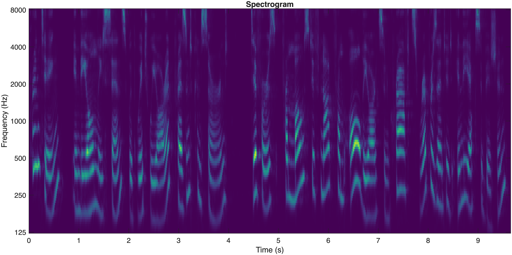
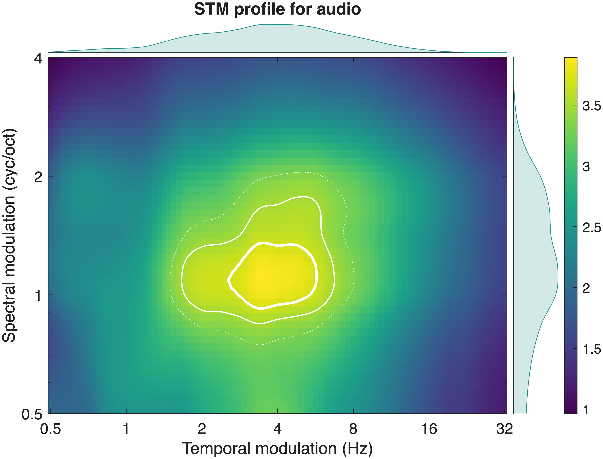

# STM MATLAB functions
MATLAB functions to compute **spectrotemporal modulation representations** from audio signals.
This pipeline allows you to:
- compute a **cochlear spectrogram**
- estimate a **spectrotemporal modulation profile** (MPS/MRF)

## Example output
### Spectrogram

### Modulation profile

---

## Getting started
Add the functions to your MATLAB path:
```matlab
addpath(genpath('path_to_repo/functions'));
```
Then run one of the scripts in the `examples/` folder.
---

## Dependencies
This code requires:
- MATLAB
- Auditory Modeling Toolbox (AMToolbox)
Download AMToolbox: https://amtoolbox.org
Add it to your MATLAB path:
```matlab
addpath(genpath('path_to_amtoolbox'));
```
---

## Example audio
The example audio file is derived from the **LJ Speech Dataset** (public domain):  
https://keithito.com/LJ-Speech-Dataset/

## Data availability
Data are available on Zenodo: 

Huet, M.-P., & Elhilali, M. (2026). 
The shape of attention reflects flexible filtering of natural speech modulations. [Data set]. 
Zenodo. https://doi.org/10.5281/zenodo.19745687

## Reference

If you find the code useful for your research, please consider citing:

```bibtex
@article{huet2025shape,
  title={The shape of attention: How cognitive goals sculpt cortical representation of speech},
  author={Huet, Moira-Phoebe and Elhilali, Mounya},
  journal={bioRxiv. https://doi.org/10.1101/2025.05.22.655464},
  year={2025}
}
```


